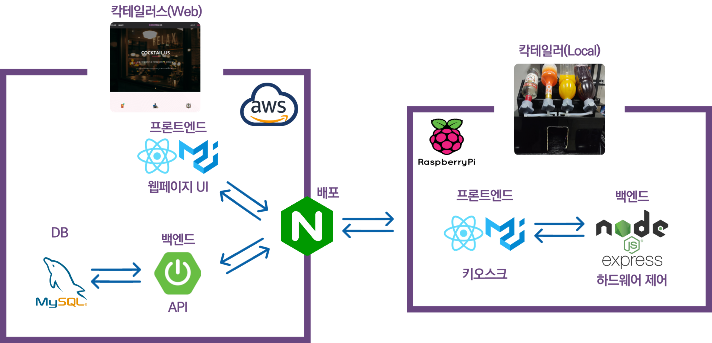
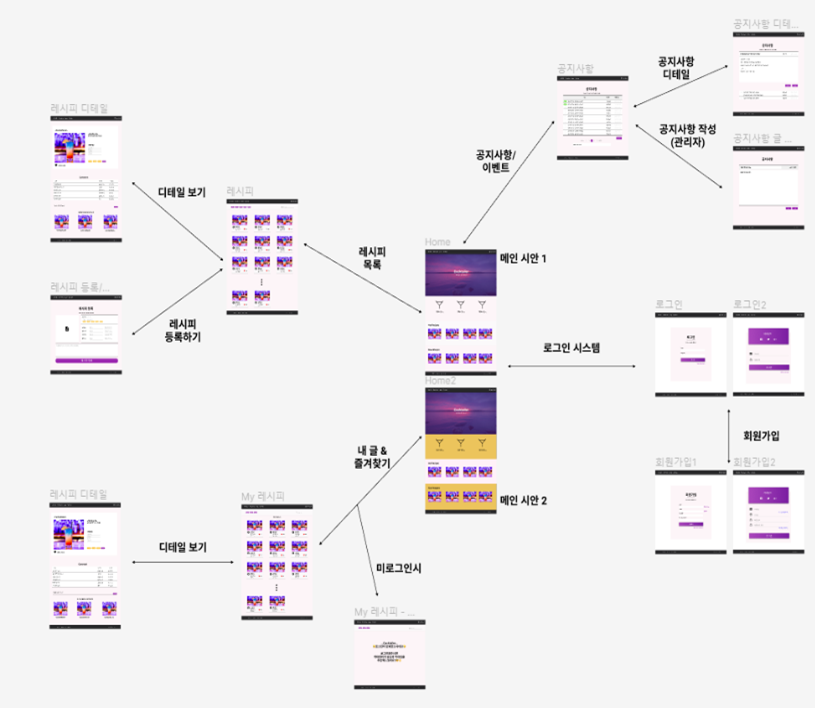
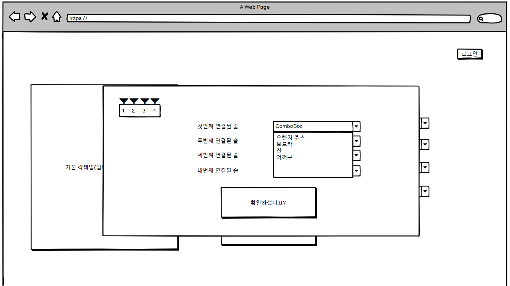
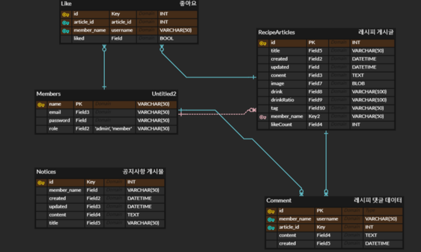

[TOC]

# 🍸Cocktail.Us

> Cocktail + Us
>
> 칵테일을 좋아하는 우리들을 위한 칵테일 레시피 공유 및 제조 서비스
>
> 개발기간 : 7/12 ~ 8/20 (6주)
>
> 배포 주소: https://i5a103.p.ssafy.io/


## 🤔왜 Cocktail.Us를 만들었나요?

1. 나만의 칵테일 레시피를 남들과 공유하고 싶은 '희재'를 위해
2. 칵테일을 좋아하지만 만드는 방법은 모르는 '지환'이를 위해
3. 칵테일을 좋아하지만 직접 만들기는 귀찮은 '기호'를 위해
4. 코딩에 지칠 때 한 잔 하면서 스트레스를 풀고 싶은 '규태'를 위해

**칵테일을 잘 알아도, 잘 몰라도 칵테일을 좋아한다면 누구나 쉽게 칵테일을 즐길 수 있게 하기 위해 `Cocktail.Us` 프로젝트를 시작하였습니다.**


## 팀원 소개 및 담당역할

> 담당 역할, 기술

#### 이희재 (Leader)

- Project Leader
- Embedded FE 담당
- Web - FE 보조

#### 방지환

- FE 담당자

#### 신기호

- Embedded 담당자
- UCC 제작

#### 임규태

- BE 담당자
- DB / 서버 관리


## 🎥프로젝트 소개

> 소개 영상 : https://youtu.be/T6K2UBvN3Ao
>
> 사용 설명서: [서비스시나리오](./exec/4.시연시나리오.md)

### 간략한 기능 미리보기

#### 메인페이지, 회원가입 & 로그인


#### 레시피 공유


#### 칵테일 제조


## 💻개발 스택

#### Frontend

- React, Material-UI, React-router

#### Backend

- Spring Boot, JPA & Hibernate, Spring Security , Swagger

#### Embedded

- RaspberryPi, Node.js, Express, React

#### DB

- MySQL, AWS S3

#### 배포

- AWS EC2, nginx

#### 협업툴

- JIRA(일정관리), Gitlab(코드관리)
- Notion(정리용), Discord, Webex(스크럼미팅)


## 🔎서비스 구조



#### 1. 칵테일러스(Web Service)

- React

- Spring-boot

#### 2. 칵테일러(Local Service)

- React

- Express

- RaspberryPi

#### 3. Server

- AWS EC2, Nginx

- DB : MySQL ,AWS S3(이미지)


## ⚙Getting Started

> 프로젝트 환경설정

#### backend (Spring-boot)

#### frontend, kiosk (React)

```bash
$ npm install
$ npm start
```

#### kiosk_backend (Express)

#### Server

>  [배포문서 참고](./exec/1.gitlab_소스_클론_이후_빌드_및_배포.pdf)


## 🎨Design

> https://www.figma.com/file/izR0IDEuFe6mNSpEEZ1WoN/material-kit-free?node-id=0%3A1 - Figma (Web용)
>
> https://balsamiq.cloud/sa0ta5t/pbvs7zb/r3020 - Balsamiq (Embedded Kiosk용)
>
> 메인색상은 칵테일바의 분위기에 어울리도록 Black + Pink + Purple 로 선정

### Web



### Embedded - Kiosk




## 📝ERD설계

> https://www.erdcloud.com/d/nsaZWcpuitdyf5qxc




## ✒API 설계

>  Backend와 Frontend간 소통을 위한 RESTful API 문서화
>
> https://app.swaggerhub.com/apis/lktg/Cocktailer/1.0.0 - SwaggerHub


## 📃네이밍 규칙

### 1. Commit Message

#### Commit Rule

```markdown
<type>(<scope>): <subject>          -- 헤더
<BLANK LINE>
<body>                              -- 본문
<BLANK LINE>
<footer>                            -- 바닥글
_____________________________________________
Feat(): "추가 로그인 함수"

로그인 API 개발

Resolves: #123
Ref: #456
Related to: #48, #45
```

#### Type

- **Feat** : 새로운 기능에 대한 커밋
- **Build** : 빌드 관련 파일 수정에 대한 커밋
- **Fix** : 버그 수정에 대한 커밋
- **Chore** : 그 외 자잘한 수정에 대한 커밋
- **Ci** : CI관련 설정 수정에 대한 커밋
- **Docs** : 문서 수정에 대한 커밋
- **Style** : 코드 스타일 혹은 포맷 등에 관한 커밋
- **Refactor** :  코드 리팩토링에 대한 커밋
- **Test** : 테스트 코드 수정에 대한 커밋

### 2. Branch

#### Branch Rule

- `Master` branch : 제품으로 출시될 수 있는 브랜치
	배포(Release) 이력을 관리하기 위해 사용. 즉, 배포 가능한 상태만을 관리한다.
- `Develop` branch : 다음 출시 버전을 개발하는 브랜치
	기능 개발을 위한 브랜치들을 병합하기 위해 사용.
	
	모든 기능이 추가되고 버그가 수정되어 배포 가능한 상태라면 `Develop` 브랜치를 `Master`브랜치에 **Merge**한다.
	
	평소에는 Develop 브랜치를 기반으로 개발을 진행한다.
- `Feature` branch : 기능을 개발하는 브랜치 ( Ex) `feature/login` )
	새로운 기능 개발 및 버그 수정이 필요할 때마다 `Develop` 브랜치로부터 분기하여 사용.

	`Feature` 브랜치에서의 작업은 기본적으로 공유할 필요가 없기 때문에, 로컬 저장소에서 관리함.

	개발이 완료되면 `Develop` 브랜치로 **Merge**하여 다른사람들과 공유한다.

	1. `Develop` 브랜치에서 새로운 기능에 대한 `Feature` 브랜치를 분기
	2. 새로운 기능에 대한 작업 수행
	3. 작업이 끝나면 `Develop` 브랜치로 **Merge**
	4. 더 이상 필요하지 않은 `Feature` 브랜치는 삭제
	5. 새로운 기능에 대한 `Feature` 브랜치를 중앙 원격 저장소에 **Push**
- `Release` branch : 이번 출시 버전을 준비하는 브랜치 ( Ex) `release-1.2` )
	배포를 위한 전용 브랜치를 사용.

	1. `Develop` 브랜치에서 배포할 수 있는 수준의 기능이 모이면 `Release` 브랜치를 분기한다.
		- `Release` 브랜치에서는 배포를 위한 최종적은 **버그 수정, 문서 추가**등 Release와 직접적으로 관련된 작업을 수행한다.
		- `Release` 브랜치에는 새로운 기능을 추가로 **Merge하지 않는다.**
	2. `Release` 브랜치에서 배포 가능한 상태가 되면, 즉 모든 기능이 정상적으로 동작하는 상태가 되면
		1. `Master` 브랜치에 **Merge**한다. 이 때, Commit에 Release 버전 Tag를 부여한다.
		2. 배포를 준비하는 동안 `Release` 브랜치에서 변경 사항이 있을 수 있으므로 `Develop` 브랜치에도 **Merge**한다.
- `Hotfix` branch : 출시 버전에서 발생한 버그를 수정 하는 브랜치 ( Ex) `hotfix-1.2.1` )
	배포한 버전에 긴급하게 수정을 해야 할 필요가 있을 경우 `Master` 브랜치에서 분기하는 브랜치.

	1. 배포 버전에 수정이 필요한 경우 `Master` 브랜치에서 `Hotfix` 브랜치를 분기한다.
	2. 문제가 되는 부분만 빠르게 수정한다.
	3. 다시 `Master` 브랜치에 **Merge**하여 배포한다.
		- 새로운 버전 이름으로 태그를 매긴다.
	4. `Hotfix` 브랜치에서 변경 사항은 `Develop` 브랜치에도 **Merge**한다.


### 3. Jira Issue

```markdown
- Epic (큰틀) :프로세스 단위로 구분 (기획, 설계, 구현, 테스트)
    ex) 회원관리 서비스 기획

- Story (이야기) : “{사용자} 로써 {무엇}을 하고싶다” 에 대한 액터의 유즈케이스
    ex) Frontend 설계 - 로그인 페이지 설계, Backend 설계 - DB 환경 검토 및 설정

- Sub Task (부작업) : 스토리 혹은 초어들을 개발하기 위해 진행되는 실제 세부 개발사항들
    ex) Frontend - onClick 함수 연결, Backend - 비밀번호 해싱 함수 구현

- Task (작업) : 구현에는 직접적으로 관련이 없는 업무 (문서작성 등)
    ex) 회원관리 서비스 기획 문서화(.ppt, .md ...), AWS 환경 설정

- Bug (버그) : 테스트 엔지니어로부터 버그로 리포팅된 타입
    ex) 로그인 버튼 5번 누르면 관리자로 로그인 되는 문제 발생
```


### 4. 클래스 / 변수명

> 무슨 목적인지 이해하기 쉽도록 최대한 자세하게 작성

#### 1. Class

- PascalCase

#### 2. variable / function

- camelCase

#### 3. 상수

- UPPERCASE


## 💡배운점, 느낀점, etc

> 프로젝트 진행하면서 배운 내용, 느낀점, 좋았던점, 아쉬운점 등

